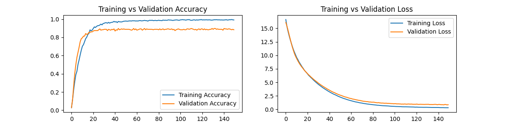
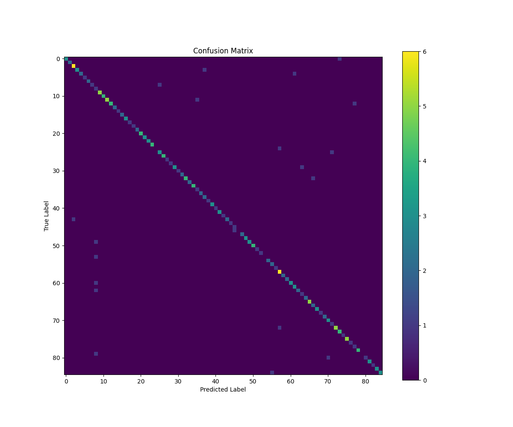
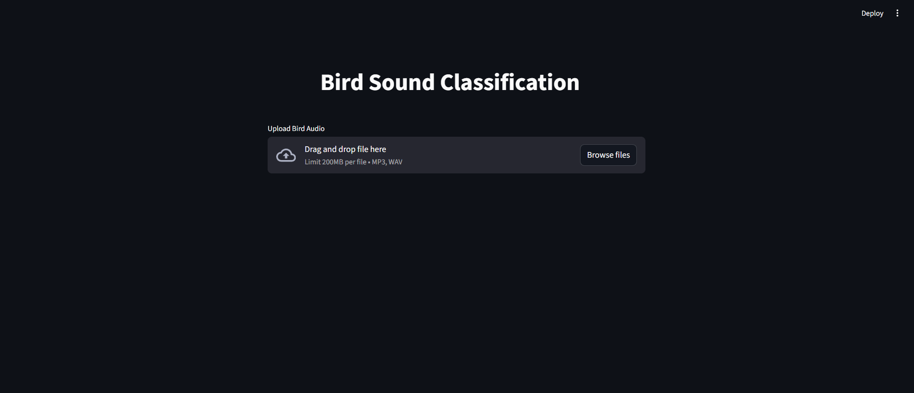
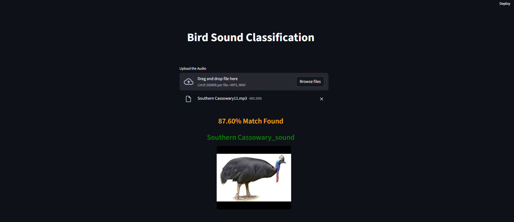

# 🐦 Bird Sound Classification using 1D CNN


An end-to-end deep learning system built for automatic bird species recognition using audio recordings. The project leverages MFCC-based audio feature extraction and a sequential 1D Convolutional Neural Network (Conv1D) architecture to classify 114 different bird species efficiently.

---

# 📌 Project Overview

Bird sound recognition is an important task in ecological monitoring, biodiversity conservation, and wildlife research. Manual identification of bird species from large-scale audio recordings is time-consuming and requires domain expertise.

This project automates the classification process using:

- MFCC Feature Extraction
- Sequential 1D Convolutional Neural Networks
- Audio Augmentation
- Streamlit-based Real-Time Inference

The system is capable of classifying **114 unique bird species** directly from `.mp3` and `.wav` audio recordings.

---

# ⚙️ Processing Pipeline

```text
[Raw Audio (.mp3/.wav)]
        ↓
[Librosa Audio Loading]
        ↓
[40 MFCC Sequential Feature Extraction]
        ↓
[Padding / Truncation]
        ↓
[1D Convolutional Neural Network]
        ↓
[Softmax Classification]
        ↓
[Predicted Bird Species]
```

---

# 📊 Performance Analysis & Results

| Metric | Score |
|---|---|
| Test Accuracy | **90.78%** |
| Test Loss | **0.6071** |
| Weighted Precision | **0.93** |
| Weighted Recall | **0.91** |
| Weighted F1-Score | **0.91** |

---

# 📈 Training Analysis

## Training vs Validation Accuracy



## Confusion Matrix



---

# 💻 Streamlit Deployment

## Streamlit Interface



## Prediction Example



---

# ▶️ Running the Project

```bash
streamlit run app.py
```

---

# 👨‍💻 Author

**Mukundh Reddy**
